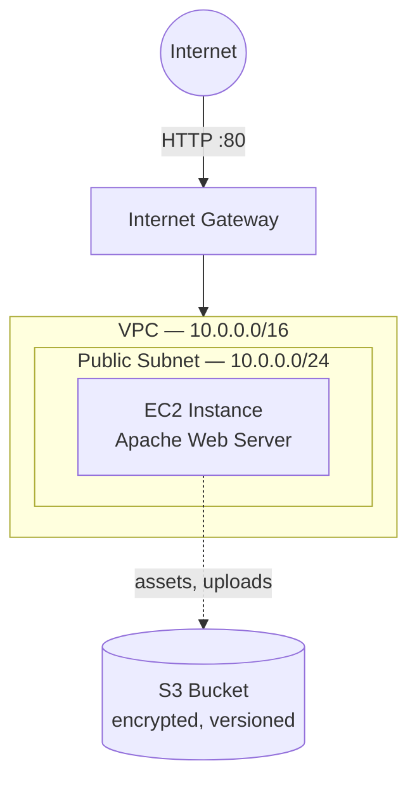

# AWS re/Start — CloudFormation Web Server Stack

An Infrastructure-as-Code proof-of-concept built while completing the AWS
re/Start program: a single template that deploys a VPC, a public subnet, a
security-group-scoped EC2 web server running Apache, and an S3 bucket for
application assets — all from one `cloudformation deploy` command instead
of manual console clicking.

## Architecture



- **VPC + public subnet**: a self-contained network with its own route
  table pointing `0.0.0.0/0` at the Internet Gateway, so the subnet is
  genuinely public rather than relying on default VPC behavior.
- **Security group**: HTTP open to the world (it's a public web server),
  SSH restricted to a parameterized CIDR — defaults to open for easy
  first deployment, but the template is written to make locking it down
  to a single IP a one-parameter change, not a template edit.
- **EC2 instance**: AMI resolved dynamically via SSM Parameter Store
  (`LatestAmiId`), so the template deploys the current Amazon Linux image
  in whatever region it's launched — no hardcoded, region-specific AMI ID
  to go stale.
- **S3 bucket**: encrypted at rest, versioned, and fully blocked from
  public access — the web server can read/write to it, but nothing on the
  open internet can reach it directly.

## Deploying

```bash
aws cloudformation create-stack \
  --stack-name rb-webserver-stack \
  --template-body file://template.yaml \
  --capabilities CAPABILITY_NAMED_IAM \
  --parameters ParameterKey=KeyName,ParameterValue=<your-key-pair-name>

aws cloudformation wait stack-create-complete --stack-name rb-webserver-stack

aws cloudformation describe-stacks \
  --stack-name rb-webserver-stack \
  --query 'Stacks[0].Outputs' \
  --output table
```

Grab `WebsiteURL` from the outputs and open it in a browser — it should
serve the Apache test page defined in `UserData`.

### Tearing down

```bash
aws cloudformation delete-stack --stack-name rb-webserver-stack
```

If you've uploaded any files to the S3 bucket before deleting the stack,
the delete will fail with `DELETE_FAILED` — CloudFormation refuses to
delete a non-empty bucket by design, as a safeguard against accidental
data loss. Empty the bucket first (`aws s3 rm s3://<bucket-name>/ --recursive`)
if you want a full teardown, or leave the bucket to persist assets beyond
the stack's lifecycle.

## Design decisions

| Decision | Why |
|---|---|
| SSM Parameter Store for the AMI ID | Keeps the template portable across regions and future-proof against AMI deprecation — no manual lookup or hardcoded ID. |
| `PublicAccessBlockConfiguration` on the S3 bucket | Default-deny is safer than default-allow; the bucket should only be reachable through the application, not directly from the internet. |
| SSH CIDR as a parameter, not hardcoded | Lets me deploy quickly for testing while making the "restrict this before real use" step explicit and easy — one parameter, not a template edit. |
| No `DeletionPolicy: Retain` override on the bucket | CloudFormation's default behavior (refuse to delete a non-empty bucket) is the correct safety net; overriding it to force-delete would remove that protection. |

## Troubleshooting notes — a real debugging story

Early in building this, I intentionally introduced a bug to practice
diagnosing CloudFormation failures: a `UserData` script that referenced a
package name that didn't exist on the AMI it was running against. The
stack failed, but the interesting part was *why it took a moment to see
why*:

1. **The stack rolled back before I could inspect anything.**
   CloudFormation's default behavior on a failed resource is to roll back
   the entire stack — which means the EC2 instance that had the failing
   `UserData` script (and its logs) was deleted along with everything else
   before I could SSH in and look at what went wrong.

2. **The fix was `--on-failure DO_NOTHING`.** Re-running the stack creation
   with this flag stops CloudFormation from auto-rolling-back on failure,
   which leaves the failed EC2 instance running long enough to actually
   investigate it.

3. **`cloud-init-output.log` had the answer.** SSH'ing into the instance
   and checking `/var/log/cloud-init-output.log` showed the exact failing
   command from the `UserData` script — a package manager error, several
   lines up from the bottom of the log, easy to miss if you only look at
   the last line.

4. **The `-e` flag mattered.** The script's shebang line
   (`#!/bin/bash -xe`) is what made the failure surface at all — `-e`
   stops the script immediately on the first non-zero exit code instead of
   continuing past a broken command and failing silently later, which
   would have been much harder to trace back to its actual cause.

The takeaway that stuck with me: **a CloudFormation stack failure is rarely
the actual error message you see in the console — it's almost always one
layer down, in whatever ran inside the failing resource.** Getting
comfortable reaching for `--on-failure DO_NOTHING` and the instance's own
logs, instead of just re-reading the CloudFormation event history over and
over, was the actual skill this exercise built.

## What I'd add next

- A second, private subnet with a NAT gateway, moving the EC2 instance
  behind a load balancer instead of exposing it directly — this template
  is intentionally single-tier for clarity, but a load-balanced multi-AZ
  version is the natural next iteration.
- A CloudWatch alarm on CPU utilization, tying into the monitoring
  patterns from the rest of my AWS re/Start training.
- Parameterizing the bucket name and adding a lifecycle rule to transition
  older assets to S3 Infrequent Access after a set period.
